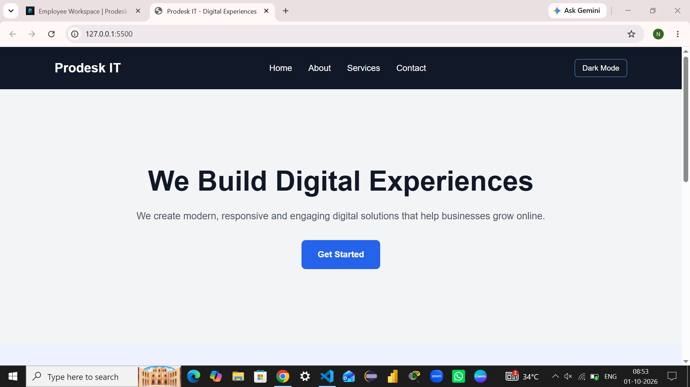
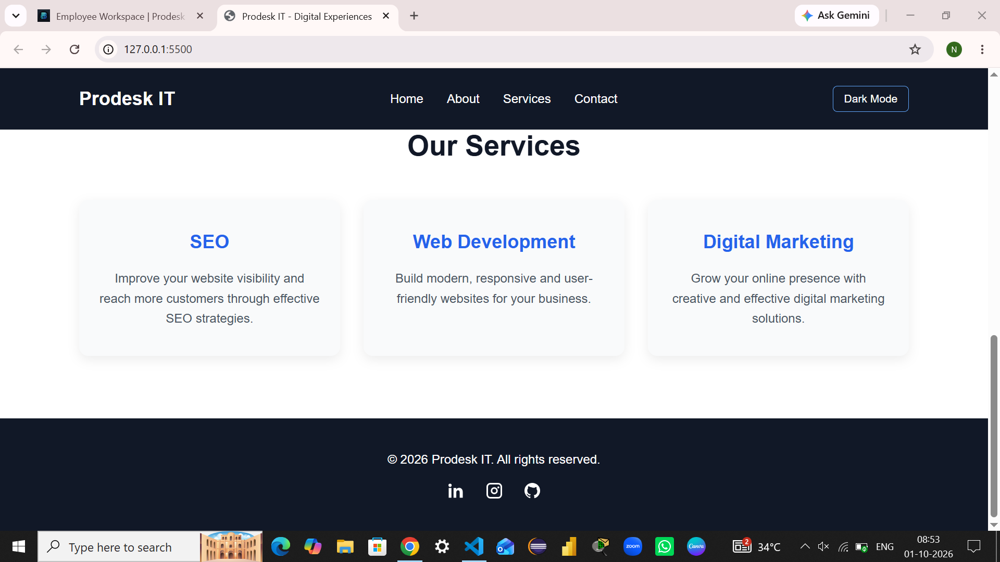
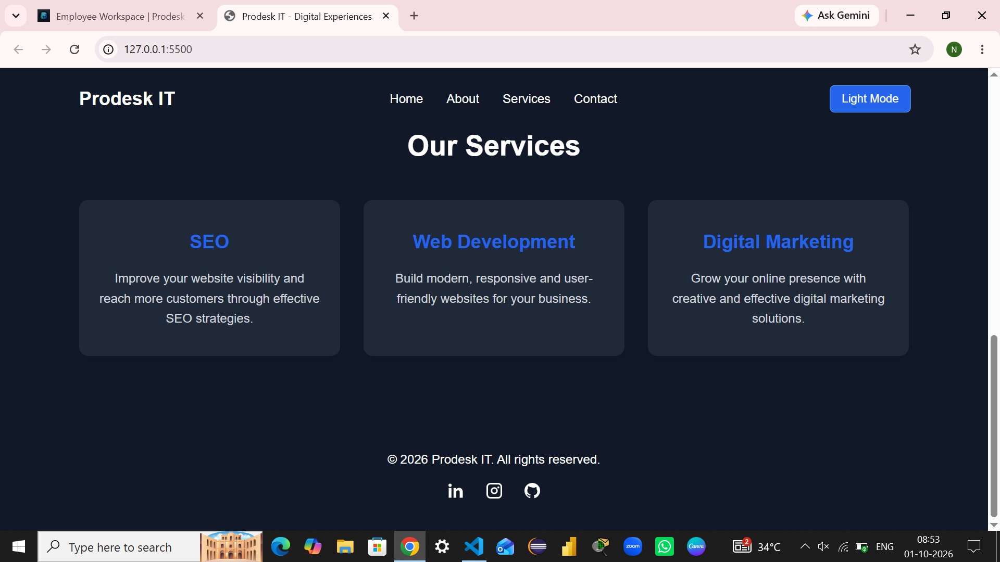

# Prodesk IT - Digital Marketing Landing Page

## About the Project

This project is a responsive digital marketing landing page created as part of Prodesk IT Sprint 01.

The website provides a clean and modern interface for presenting digital services such as SEO, Web Development and Digital Marketing.

## Features

- Responsive navigation bar
- Hero section with call-to-action button
- About section
- Services section with three service cards
- Responsive design for mobile devices
- Dark/Light mode toggle
- Social media icons
- Sticky navigation bar
- Hover and micro-interactions

## Technologies Used

- HTML5
- CSS3
- JavaScript
- Git
- GitHub

## Project Structure

```text
prodesk-sprint-01/
│
├── index.html
├── style.css
├── script.js
├── README.md
├── Prompts.md
├── home.png
├── services.png
└── dark-mode.png
```
## Live Demo

[View Live Website](https://prodesk-sprint-01-hc3q0ckw3-vision-demo1.vercel.app/)

## Screenshots

### Home Page



### Services and Footer



### Dark Mode



